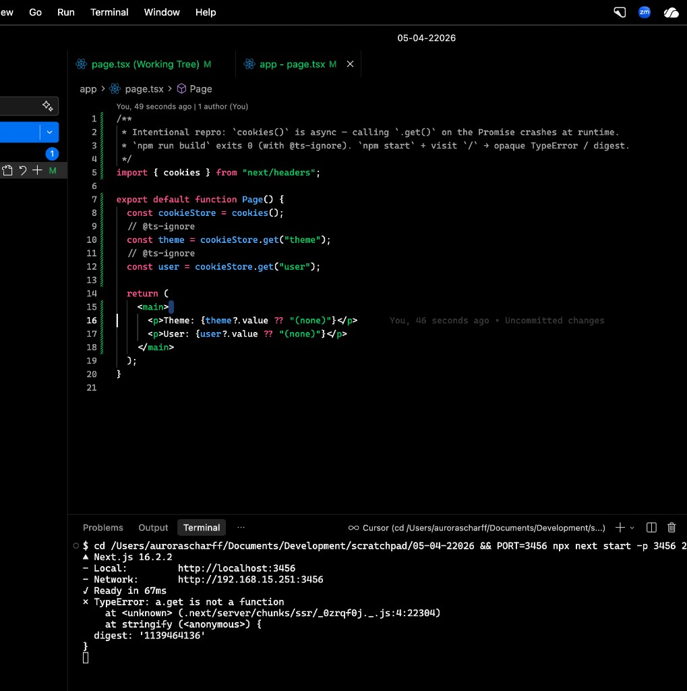

# Case: `cookies()` without `await` (opaque runtime error)

Next.js **16.2.2** — `cookies()` returns a `Promise` (since v15). This folder keeps `app/page.tsx` **intentionally wrong**: no `await`, with `// @ts-ignore` so **`npm run build` passes** and the failure only appears at **request time**.

```bash
cd cases/next-cookies-opaque-error
npm install
npm run build
npx next start -p 3000
```

Open `/` in the browser (or `curl http://localhost:3000/`).

## Why this happens

In Next.js **15+**, `cookies()` from `next/headers` is **async**: it returns `Promise<ReadonlyRequestCookies>`, not the cookie store itself.

This page calls `.get()` on that Promise. A standard `Promise` has no `.get()` method, so the minified runtime error is something like **`TypeError: a.get is not a function`**, with no hint to add `await`.

Without the `// @ts-ignore` lines, **TypeScript catches this at build time**. The ignores exist here **only** to reproduce the runtime failure.

## What we expected

- **TypeScript** to flag the mistake (it does, unless suppressed line-by-line).
- **Runtime** to suggest **`await cookies()`** instead of an opaque `.get is not a function` plus a digest.

## What you actually see



## Fix

```ts
export default async function Page() {
  const cookieStore = await cookies();
  // ...
}
```

## Upstream

Tracked in the monorepo **[github.com/aurorascharff/reproductions](https://github.com/aurorascharff/reproductions)**. Original standalone history lived under scratchpad before consolidation.
